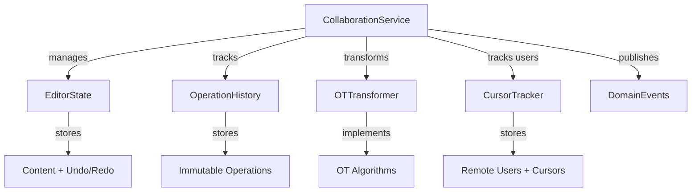
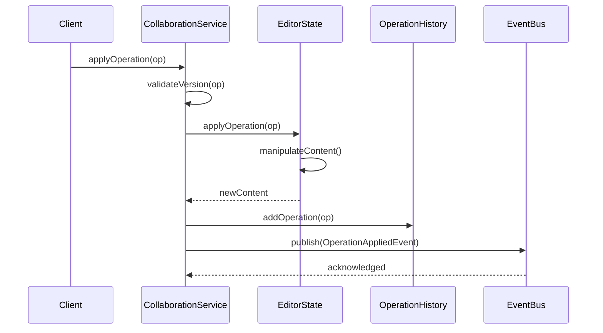
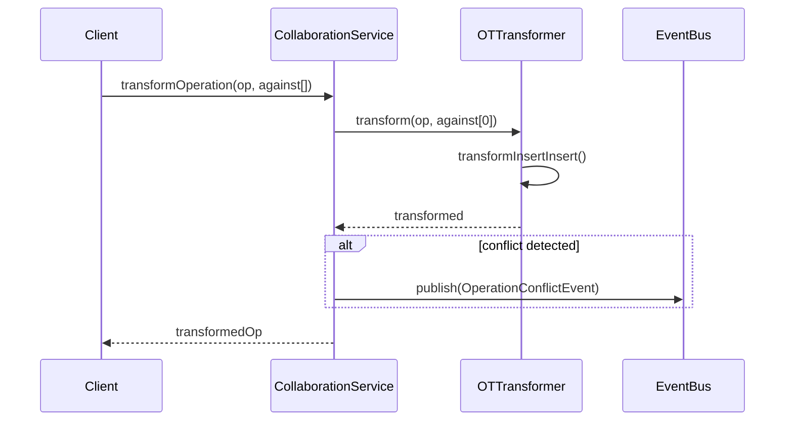
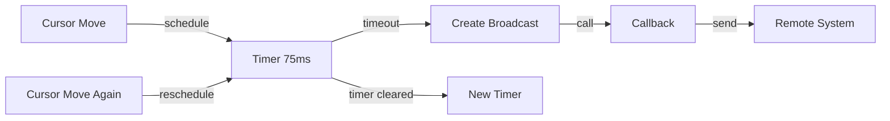

# Collaborative Editor Architecture

## Overview

The Collaborative Editor is a domain service that enables real-time multi-user editing with automatic conflict resolution through Operational Transformation (OT). It provides a foundation for building collaborative features like Monaco Editor with cursor tracking, operation versioning, and event-driven synchronization.

## Design Principles

1. **Separation of Concerns** - Each component has a single responsibility
2. **Immutable History** - Operation history is append-only for replay capability
3. **Event-Driven** - All state changes emit domain events for external systems
4. **Type Safety** - Zod schemas for all DTOs with full TypeScript validation
5. **Stateless Operations** - Each operation is independent and can be transformed

## Architecture Overview



## Core Components

### 1. CollaborationService

**Purpose**: Main orchestrator for all collaboration features

**Responsibilities**:
- Editor lifecycle management
- Operation application and validation
- Operation transformation and conflict resolution
- Remote user presence management
- Cursor broadcast scheduling
- Snapshot creation for recovery

**Key Methods**:
```typescript
initializeEditor(editorId: string, initialContent?: string): void
applyOperation(editorId: string, operation: OperationDto): void
applyOperationBatch(editorId: string, batch: OperationBatchDto): void
transformOperation(editorId: string, operation: OperationDto, against: OperationDto[]): OperationDto
addRemoteUser(editorId: string, user: RemoteUserDto): void
updateRemoteUserCursor(editorId: string, userId: string, cursor: CursorBroadcastDto): void
createSnapshot(editorId: string, clientId: string): EditorSnapshotDto
```

**State Management**:
- Multiple isolated editor instances via Map<editorId, state>
- Lazy initialization on first access
- Automatic cleanup via reset()

### 2. EditorState

**Purpose**: Manages editor content and editing state

**Responsibilities**:
- Content manipulation (insert/delete)
- Undo/redo stack management
- Mode management (ACTIVE, READ_ONLY, DISCONNECTED)
- Version tracking
- Validation of operation positions

**Key Methods**:
```typescript
applyOperation(operation: OperationDto): string
setContent(content: string): void
getContent(): string
getMode(): CollaborationMode
setMode(mode: CollaborationMode): void
```

**State Structure**:
```typescript
{
  content: string
  operations: OperationDto[]
  undoStack: OperationDto[]
  redoStack: OperationDto[]
  version: number
  mode: CollaborationMode
  isTransforming: boolean
}
```

### 3. OTTransformer

**Purpose**: Implements Operational Transformation algorithms for conflict resolution

**Algorithms**:
- Insert vs Insert (position-based priority via clientId)
- Insert vs Delete (position range checking)
- Delete vs Insert (range expansion)
- Delete vs Delete (range merging and trimming)

**Key Methods**:
```typescript
static transform(op: OperationDto, against: OperationDto): OperationDto
static transformAgainstMany(op: OperationDto, others: OperationDto[]): OperationDto
static compose(op1: OperationDto, op2: OperationDto): OperationDto
```

**Conflict Resolution**:
- Deterministic via client ID comparison (ensures consistency across clients)
- Preserves causal ordering
- Idempotent (multiple applications produce same result)

### 4. OperationHistory

**Purpose**: Immutable operation log with version tracking

**Responsibilities**:
- Store operations in order received
- Track version numbers
- Query operations by version, client, or range
- Create/restore snapshots
- Support rebase for client recovery

**Key Methods**:
```typescript
addOperation(operation: OperationDto): void
getOperationsSince(version: number): OperationDto[]
getOperationsBetween(start: number, end: number): OperationDto[]
getOperationsByClient(clientId: string): OperationDto[]
getSnapshot(): HistorySnapshot
rebase(fromVersion: number, toVersion: number, newOps: OperationDto[]): void
```

### 5. CursorTracker

**Purpose**: Manages remote user presence and cursor positions

**Responsibilities**:
- Track active/inactive remote users
- Store cursor positions and text selections
- Transform cursors for operations
- Maintain user activity timestamps
- User lifecycle management

**Key Methods**:
```typescript
addRemoteUser(user: RemoteUserDto): void
removeRemoteUser(userId: string): void
updateRemoteUserCursor(userId: string, cursor: CursorPositionDto | null): void
updateRemoteUserSelection(userId: string, selection: SelectionDto | null): void
getActiveRemoteUsers(): RemoteUserDto[]
transformCursorForOperation(cursor: CursorPositionDto, operation: OperationDto): CursorPositionDto
```

## Data Flow

### Single Operation Application



### Operation Transformation



### Cursor Broadcast (Throttled)



## Type System (DTOs)

### Operation

```typescript
{
  id: string                    // Unique operation ID
  type: 'insert' | 'delete'    // Operation type
  position: number              // Position in content
  content: string | null        // Text for insert, null for delete
  length: number                // Length of delete, 0 for insert
  clientId: string              // Client that created operation
  timestamp: Date               // When operation was created
  version: number               // Version number for sequencing
}
```

### RemoteUser

```typescript
{
  id: string                    // User ID
  name: string                  // Display name
  color: string                 // Hex color for cursor (#RRGGBB)
  cursor: CursorPositionDto | null   // Current cursor position
  selection: SelectionDto | null     // Current selection
  isActive: boolean             // Whether user is active
  lastSeen: Date               // Last activity timestamp
}
```

### Editor Modes

```
ACTIVE        ─────┬────→ Can apply operations
                   │
                   └────→ Broadcast cursors normally
                   
READ_ONLY     ─────┬────→ Cannot apply operations
                   │
                   └────→ Still receive remote updates
                   
DISCONNECTED  ─────┬────→ Cannot apply operations
                   │
                   └────→ Cannot receive updates
                   │
                   └────→ Mode for offline support
```

## Event System

All state changes emit domain events for external system integration:

```typescript
OperationAppliedEvent
  → editorId, operationId, clientId, version, timestamp

CursorUpdatedEvent
  → editorId, clientId, cursor, selection

OperationBatchReceivedEvent
  → editorId, batchId, clientId, operationCount, baseVersion

RemoteUserConnectedEvent
  → editorId, userId, userName, color

RemoteUserDisconnectedEvent
  → editorId, userId

OperationConflictEvent
  → editorId, operationId, conflictingOperationId, resolvedUsing
```

## Performance Characteristics

### Time Complexity
- **Operation Transform**: O(m) where m = concurrent operation count
- **Cursor Transform**: O(1) for single cursor
- **History Query**: O(n) where n = total operations

### Space Complexity
- **Editor State**: O(c) where c = content length
- **Operation History**: O(n) where n = operation count
- **Cursor Tracking**: O(u) where u = number of remote users

### Optimizations
- **Cursor Throttling**: 50-100ms (configurable) reduces broadcast frequency
- **Operation Batching**: Batch operations to reduce transaction overhead
- **Lazy Initialization**: Editors created on-demand
- **Immutable History**: No deep cloning, just appends

## Integration with Monaco Editor

### Client-Side Integration

```typescript
// Listen for Monaco edits
monaco.editor.onDidChangeModelContent((event) => {
  const operation = convertDeltaToOperation(event.changes);
  sendToServer(operation);
});

// Apply incoming operations
collaboration.onOperationApplied((op) => {
  const deltas = convertOperationToDeltas(op);
  editor.executeEdits('collab', deltas);
});

// Render remote cursors
collaboration.onRemoteUserCursorChanged((user) => {
  renderRemoteCursor(editor, user);
});
```

## Error Handling Strategy

```
OperationTransformError
  → When OT algorithm fails
  → Triggers fallback to snapshot

VersionConflictError
  → When operation version doesn't match
  → Request history sync

OperationApplyError
  → When operation cannot be applied to content
  → Triggers mode transition to READ_ONLY

CollaborationDisabledError
  → When editor not initialized
  → Graceful fallback to read-only

InvalidCursorPositionError
  → When cursor position out of bounds
  → Clamp to valid range
```

## Snapshot & Recovery

**When to Create Snapshots**:
- Periodic (every N operations)
- On client reconnection
- At sync points between clients

**Snapshot Structure**:
```typescript
{
  id: string
  content: string
  version: number
  timestamp: Date
  clientId: string
}
```

**Recovery Flow**:
1. Client detects version mismatch
2. Requests snapshot at last known version
3. Replaces local state with snapshot
4. Fetches missing operations since snapshot
5. Reapplies or transforms missing operations

## Scaling Considerations

### Single Editor Limitations
- Operation history grows unbounded (implement TTL)
- No persistence (implement snapshots to database)
- Memory usage linear with history (consider garbage collection)

### Multi-Editor Limitations
- Map lookup O(1) per editor, but scales with editor count
- Consider sharding by editor hash for very large deployments
- Implement periodic cleanup of inactive editors

### Future Enhancements
- Persistent operation history (database)
- Distributed operation log (Redis stream)
- Operation compression (delta compression)
- Selective history retention (TTL per operation)
- Client-side operation caching layer

## Testing Strategy

### Unit Tests
- EditorState: content manipulation, mode transitions
- OTTransformer: all algorithm combinations
- OperationHistory: versioning, queries, rebasing
- CursorTracker: user lifecycle, position transformation

### Integration Tests
- Full workflow: init → apply → transform → snapshot
- Multi-user scenarios: concurrent operations, conflicts
- Mode transitions: behavior in different modes
- Event publishing: all events fire correctly

### Load Tests
- Large operation histories (100k+ operations)
- Many remote users (1000+)
- Rapid cursor broadcasts
- Large batches (100 operations)

## Security Considerations

1. **Operation Validation**: Validate all operation fields
2. **Position Bounds**: Check cursor positions against content length
3. **Client ID Verification**: Ensure clientId matches authenticated user
4. **Rate Limiting**: Throttle operations per client
5. **Content Inspection**: Scan for malicious content
6. **History Retention**: Limit history size to prevent DoS

## Future Roadmap

### Phase 1 (Current)
- ✅ Core OT engine with all algorithms
- ✅ Multi-user cursor tracking
- ✅ Event-driven architecture
- ✅ Snapshot capability

### Phase 2
- [ ] Database persistence
- [ ] Operation compression
- [ ] Selective history retention
- [ ] Real-time WebSocket integration

### Phase 3
- [ ] Distributed operation log
- [ ] Cross-editor operations (references)
- [ ] Comment threads
- [ ] Rich collaboration metadata
