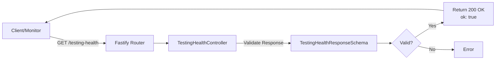

# Health Endpoint Architecture

## Overview

The health endpoint provides a simple, lightweight mechanism for monitoring the availability and health status of the API. This is a foundational service endpoint that can be queried by monitoring systems, orchestrators, and clients to verify the API is operational.

## Design Decisions

1. **Minimal Response Format**: Returns a simple `{ ok: true }` boolean response for minimal overhead and fast parsing
2. **Zod Schema Validation**: Uses Zod for compile-time type safety and runtime schema validation
3. **AutoLoad Controller Registration**: Leverages Fastify's AutoLoad plugin for automatic endpoint discovery and registration
4. **GET-Only Method**: Uses HTTP GET as the endpoint is idempotent and requires no request body
5. **HTTP 200 Status**: Returns 200 OK on success, no content negotiation required

## Components

### Schema Definition
**File**: `core/api/src/schemas/testingHealth.schemas.ts`

Defines the `TestingHealthResponseSchema` using Zod:
```typescript
export const TestingHealthResponseSchema = z.object({
  ok: z.boolean(),
});
```

This ensures type-safe validation of the response structure.

### Controller Implementation
**File**: `core/api/src/controllers/testingHealth.controller.ts`

Implements the Fastify controller as a default export function that:
- Registers a GET route at `/testing-health`
- Includes response schema validation via `zodToJsonSchema`
- Returns `{ ok: true as const }` with strict type safety
- Is automatically loaded by Fastify's AutoLoad plugin

## Data Flow



## API Contract

### Endpoint
- **Method**: GET
- **Path**: `/testing-health`
- **Authentication**: None required
- **Request Body**: None

### Response
**Status Code**: 200 OK

**Content-Type**: application/json

**Body**:
```json
{
  "ok": true
}
```

### Schema
```typescript
{
  ok: boolean  // Always true when endpoint is operational
}
```

## Integration Points

### AutoLoad Plugin
The controller is automatically discovered and registered by Fastify's AutoLoad plugin configured in `core/api/src/app.ts`. All controller files in `core/api/src/controllers` are automatically loaded.

### Response Schema Validation
The `zodToJsonSchema` utility converts the Zod schema to a JSON Schema format compatible with Fastify's swagger documentation and response validation.

## Future Considerations

1. **Extended Health Data**: Could be extended to return additional health metrics (uptime, service dependencies, memory usage)
2. **Conditional Endpoints**: Could add conditional logic for deeper health checks (database connectivity, external service availability)
3. **Standardized Format**: Consider adoption of standardized health check formats (RFC 7231, CloudWatch-compatible)
4. **Monitoring Integration**: Integrate with monitoring systems like Datadog, New Relic, or CloudWatch for automated health tracking

## Performance Characteristics

- **Response Time**: < 1ms (no external dependencies or computations)
- **Memory Usage**: Negligible
- **Overhead**: Minimal - simple boolean return
- **Scalability**: Not a bottleneck; suitable for high-frequency monitoring

## Security Considerations

- **No Authentication Required**: Health endpoint is publicly accessible (intentional for monitoring systems)
- **No Data Exposure**: Returns no sensitive information
- **Rate Limiting**: Could be added at orchestrator level if needed
