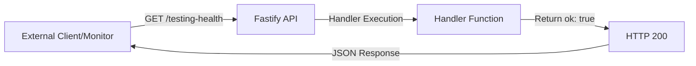

# Testing Health Endpoint Architecture

## Overview

The Testing Health endpoint provides a simple, public health check mechanism for external services and monitoring tools to verify the API is running and responsive. This is a lightweight, dependency-free endpoint designed for basic availability verification and is not intended to replace comprehensive health checks that test database connectivity or external service dependencies.

## Design Decisions

1. **Public Route**: No authentication required, allowing any client to check API health without credentials
2. **Minimal Response**: Returns a simple boolean `ok: true` to keep the response lightweight and fast
3. **Dedicated Endpoint**: Separate from other health-related operations to isolate health check logic
4. **Zod Schema Validation**: Uses Zod for request/response validation consistency with the rest of the API

## Components

### Schema (`core/api/src/schemas/testingHealth.schemas.ts`)

- **TestingHealthResponseSchema**: Zod schema enforcing response shape with `ok: z.literal(true)`
- **TestingHealthResponse**: TypeScript type derived from schema for type safety

### Controller (`core/api/src/controllers/testingHealth.controller.ts`)

- **TestingHealthController**: Fastify controller registering a single GET route
- Automatically loaded by the Fastify auto-loader plugin system
- Uses JSON schema for OpenAPI/Swagger documentation
- Returns synchronous response for minimal latency

## Data Flow



## API Contracts

### Endpoint

```
GET /testing-health
```

### Response

**Status Code**: 200 OK

**Content-Type**: application/json

**Body Schema**:
```json
{
  "ok": true
}
```

### Authentication

None required (public endpoint)

## Implementation Details

- **Handler Type**: Async function following Fastify conventions
- **Error Handling**: Inherits from API-level error handlers
- **Validation**: Response validated against Zod schema via `zodToJsonSchema`
- **Auto-loading**: Controller automatically discovered and loaded by Fastify plugin system

## Future Considerations

1. **Extended Health Checks**: Could be expanded to include database connectivity checks
2. **Readiness vs. Liveness**: Current implementation is suitable for liveness probes; readiness probes may need additional dependencies checks
3. **Metrics Integration**: Could be extended to include basic metrics (uptime, response times)
4. **Service Dependencies**: If future requirements need to check external services, consider creating a separate comprehensive health endpoint

## Related Files

- Schema: `core/api/src/schemas/testingHealth.schemas.ts`
- Controller: `core/api/src/controllers/testingHealth.controller.ts`
