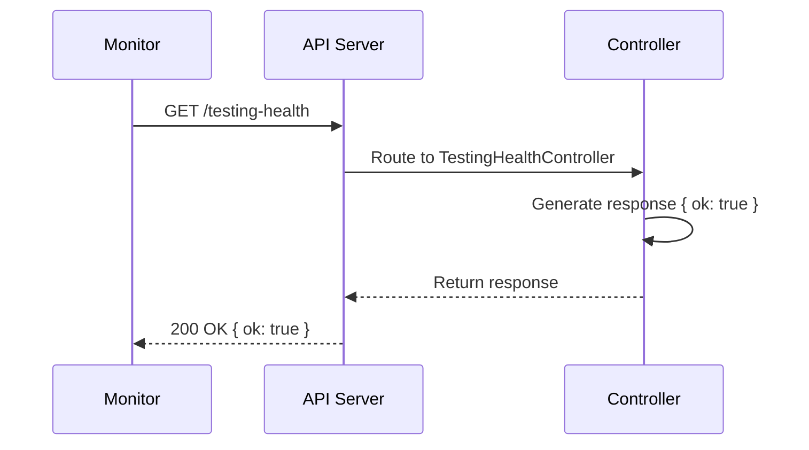

# Testing Health Endpoint Architecture

## Overview

The Testing Health endpoint provides a simple, publicly accessible health check for the API. External services and monitoring tools can use this endpoint to verify that the API is running and operational.

## Design Decisions

- **Public Route**: No authentication required to keep the endpoint lightweight and accessible to all monitoring tools
- **Simple Response**: Returns only `{ ok: true }` to minimize payload and processing overhead
- **Dedicated Controller**: Follows the project's auto-loaded controller pattern for consistency with other API endpoints
- **Type-Safe Schema**: Uses Zod schema validation to ensure response correctness

## Components

### 1. Response Schema (`core/api/src/schemas/testingHealth.schemas.ts`)
- **TestingHealthResponseSchema**: Zod schema that validates the response contains `ok: true`
- **TestingHealthResponse**: TypeScript type inferred from the Zod schema

### 2. Controller (`core/api/src/controllers/testingHealth.controller.ts`)
- **TestingHealthController**: Fastify controller that registers the GET endpoint
- Automatically loaded by Fastify's AutoLoad plugin
- Returns `{ ok: true }` response with HTTP 200 status

## Endpoint Specification

**Route**: `GET /testing-health`

**Response Schema**:
```json
{
  "ok": true
}
```

**Status Codes**:
- `200 OK`: API is running and operational

## Data Flow



## Integration Points

- **Auto-Loading**: The controller is automatically discovered and loaded by the Fastify AutoLoad plugin from the controllers directory
- **Swagger Documentation**: The endpoint is automatically documented via `zodToJsonSchema` integration with Swagger

## Future Considerations

- Could be expanded to include more detailed health information (database connectivity, external service status)
- Could implement health check levels (simple, detailed, comprehensive)
- Response could be cached to reduce overhead on high-frequency monitoring
